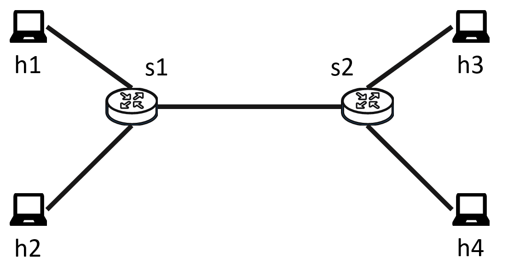

# CS 514 Lab2 - Dumbbell
In this lab, you will gain a little experience programming a packet-processing pipeline using the P4 programming language. In doing so, you will also learn a bit about using the Mininet network simulator.

## 0. Prepare the environment
1. We have prepared a [docker image](https://hub.docker.com/layers/172524248/zx0319/p4lab/ready/images/sha256-421180232d5b6526b7b6fefd60eb1603293269662a0665ab3b95af0fb75af266?context=repo) for you. You can use `docker run --privileged -it zx0319/p4lab:ready bash` to open a bash terminal in the docker container. Note: This docker image will only run on an x86 machine (not for ARM machines, such as M1/M2 Macs). You can run this on the [VCM](https://vcm.duke.edu/). Please make sure you have enough storage space (16GB+) to pull the image and run it.
2. Clone this [lab2 repository](https://gitlab.oit.duke.edu/tm326/cs514-lab2) to your `/home` folder inside the container.
3. You can use VSCode to attach to the (remote) docker container for development. If you are using the VCM, you can SSH to your VCM using VSCode and install the docker extension in your VCM to connect to the container.

## 1. Single Link Dumbbell

In this lab, we use a dumbbell topology that connects four hosts (h1-h4) with two programmable switches (s1, s2).


1. Please fill in the MAC and IP addresses of h1-h4, s1, and s2 in the [lab2 question set](https://www.gradescope.com/courses/429975/assignments/2367568/). You can get all this information from the files under `./pod-topo/*`.
2. Each switch already contains a table to be used in longest prefix matching. Please fill in the table for each switch in the [lab2 question set](https://www.gradescope.com/courses/429975/assignments/2367568/).
3. Use `make run` to compile `basic.p4` and boot up mininet to test the connectivity.  You can use `h1 ping h2` to test the connectivity between every two hosts.  Please fill in the pairwise connectivity questions in the [lab2 question set](https://www.gradescope.com/courses/429975/assignments/2367568/). Then use `exit` to exit mininet, and use `make stop` to clean the network settings.
4. Complete `basic.p4`. In the [`MyParser()`](./basic.p4#L55) you can extract the header fields and in [`MyIngress()`](./basic.p4#L81) adopt the longest prefix matching table which was defined in the previous section to enable the routing. Set corresponding ethernet fields and egress ports, and decrease the TTL accordingly. In [`MyDeparser()`](./basic.p4#L147), you still need to assemble the ethernet and IPv4 header.
5. Use `make run` to run the new version `basic.p4`, then, fill in the pairwise connectivity in the [lab2 question set](https://www.gradescope.com/courses/429975/assignments/2367568/).  If you implement step 4 correctly, you should only see h3 detached from the network. This detachment is caused by the incomplete routing table in s1 and s2. Please change the routing table of s1 and s2, to support routing to and from h3.
6. Submit `basic.p4`, `s1-runtime.json`, and `s2-runtime.json`.

## 2. Double Links Dumbbell

1. Use `make run` to run the current code again. This time, we will use [iperf](https://openmaniak.com/iperf.php) to measure the usable bandwidth. Use `h3 iperf -s &` and `h4 iperf -s &` to run iperf in server mode in `bg` on h3 and h4. Then use `h1 iperf -c h3` to measure the usable bandwidth between h1 and h3. After that, use `h2 iperf -c h4` to measure the usable bandwidth between h2 and h4. Then use
    ```
    h1 iperf -c h3 &
    h2 iperf -c h4

    ```
    to measure the usable bandwidth while communicating concurrently. After the second command is finished, use `h1 bg` to retrieve the previous result. Fill in those numbers in the [lab2 question set](https://www.gradescope.com/courses/429975/assignments/2367568/).

2. Answer the questions in [lab2 question set](https://www.gradescope.com/courses/429975/assignments/2367568/) about when and why two flows are traveling across the dumbbell, they receive only proportional bandwidth on one link.  Do you have ideas on how to improve this?


3. Yes! We can balance the load with one more link! You can improve the topology by connecting `s1-p4` with `s2-p4`.

4. Changing the `topology.json` is not enough, you have to tell s1 and s2 to differentiate the flow from h1 to h3, and h2 to h4, and route them across different links. Please change the related longest prefix matching table accordingly.

5. Rerun the mininet and test the concurrent bandwidth with
    ```
    h1 iperf -c h3 &
    h2 iperf -c h4

    ```
    And fill the numbers in [lab2 question set](https://www.gradescope.com/courses/429975/assignments/2367568/).
6. Submit `basic.p4`, `s1-runtime.json`, `s2-runtime.json`, and `topology.json`.
